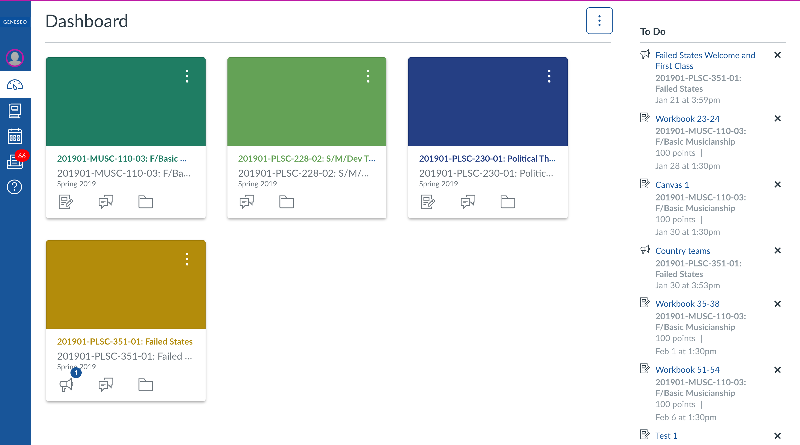
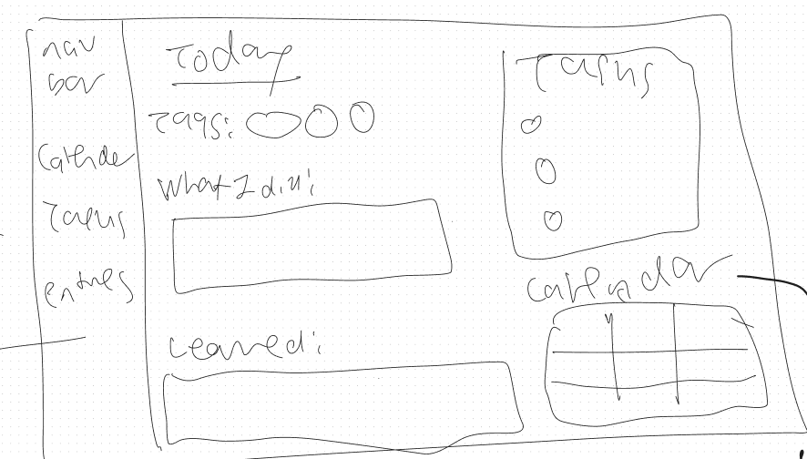
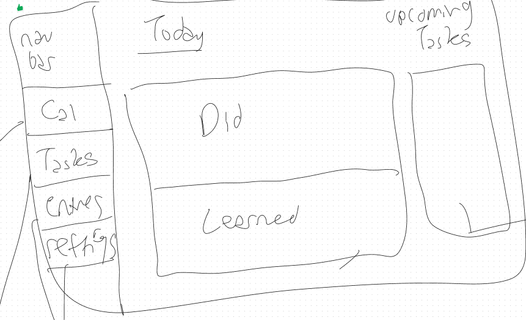

---
# Configuration for the Jekyll template "Just the Docs"
parent: Decisions
nav_order: 100
title: ADR Template

# These are optional elements. Feel free to remove any of them.
# status: {proposed | rejected | accepted | deprecated | … | superseded by [ADR-0005](0005-example.md)}
date: {2024-05-09 when the decision was last updated}
deciders: {Kane, Luca, Peter, Michael, Diego, Abdulaziz}
# consulted: {list everyone whose opinions are sought (typically subject-matter experts); and with whom there is a two-way communication}
# informed: {list everyone who is kept up-to-date on progress; and with whom there is a one-way communication}
---
<!-- we need to disable MD025, because we use the different heading "ADR Template" in the homepage (see above) than it is foreseen in the template -->
<!-- markdownlint-disable-next-line MD025 -->
# The decision regarding the UI layout and design

## Context and Problem Statement

Before diving into coding the initial HTML structure, we need to establish the general UI design. Since there are various UI design concepts to consider, we have to compare their pros and cons to determine the most suitable one for our project.

<!-- {Describe the context and problem statement, e.g., in free form using two to three sentences or in the form of an illustrative story.
 You may want to articulate the problem in form of a question and add links to collaboration boards or issue management systems.} -->

<!-- This is an optional element. Feel free to remove. -->
<!-- ## Decision Drivers

* {decision driver 1, e.g., a force, facing concern, …}
* {decision driver 2, e.g., a force, facing concern, …} -->
<!-- * … numbers of drivers can vary -->

## Considered Options

* Option 1: Canvas looking layout. (the color theme can later be decided)
  
* Option 2: Informative Layout.
  
* Option 3: Simple Layout.
  
<!-- * … numbers of options can vary -->

<!-- {justification. e.g., only option, which meets k.o. criterion decision driver | which resolves force {force} | … | comes out best (see below)}. -->

<!-- This is an optional element. Feel free to remove. -->
<!-- ### Consequences

* Good, because {positive consequence, e.g., improvement of one or more desired qualities, …}
* Bad, because {negative consequence, e.g., compromising one or more desired qualities, …}
* … numbers of consequences can vary -->

<!-- This is an optional element. Feel free to remove. -->
<!-- ## Validation

{describe how the implementation of/compliance with the ADR is validated. E.g., by a review or an ArchUnit test} -->

<!-- This is an optional element. Feel free to remove. -->
## Pros and Cons of the Options

### Canvas Layout

<!-- This is an optional element. Feel free to remove. -->
<!-- {example | description | pointer to more information | …} -->

* Good, because {argument a}
* Good, because {argument b}
<!-- use "neutral" if the given argument weights neither for good nor bad -->
* Neutral, because {argument c}
* Bad, because {argument d}
* … <!-- numbers of pros and cons can vary -->

### Informative Layout

* Good, because {argument a}
* Good, because {argument b}
* Neutral, because {argument c}
* Bad, because {argument d}
* …

### Simple Layout

* Good, because {argument a}
* Good, because {argument b}
* Neutral, because {argument c}
* Bad, because {argument d}
* …

## Decision Outcome

Chosen option: **Option 3: Simple Layout.**\
Because
<!-- This is an optional element. Feel free to remove. -->
<!-- ## More Information

{You might want to provide additional evidence/confidence for the decision outcome here and/or
 document the team agreement on the decision and/or
 define when this decision when and how the decision should be realized and if/when it should be re-visited and/or
 how the decision is validated.
 Links to other decisions and resources might here appear as well.} -->

